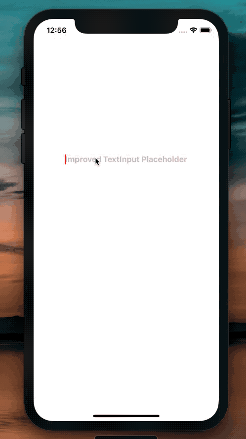

[](https://github.com/WrathChaos/react-native-improved-text-input)


[](https://github.com/WrathChaos/react-native-improved-text-input)


[](https://www.npmjs.com/package/react-native-improved-text-input)
[](https://www.npmjs.com/package/react-native-improved-text-input)

[](https://opensource.org/licenses/MIT)
[](https://github.com/prettier/prettier)

<p align="center">
  
</p>

## Installation

Add the dependency:

### React Native:

```ruby
npm i react-native-improved-text-input
```

## Peer Dependencies

###### IMPORTANT! You need install them.

```
"react": ">= 16.x.x",
"react-native": ">= 0.55.x",
```

# Usage

## Import

```js
import TextInput from "react-native-improved-text-input";
```

# Complete Example Usage

```js
import React, { useState } from "react";
import { View, StatusBar, SafeAreaView } from "react-native";
import TextInput from "react-native-improved-text-input";

const App = () => {
  const [textValue, setTextValue] = useState(null);

  handleTextOnChange = textValue => {
    setTextValue(textValue);
  };

  return (
    <View>
      <StatusBar barStyle="dark-content" />
      <SafeAreaView>
        <View
          style={{
            marginTop: "50%",
            alignItems: "center",
            justifyContent: "center"
          }}
        >
          <TextInput
            value={textValue}
            selectionColor={"red"}
            onChangeText={this.handleTextOnChange}
            style={{ fontSize: 20, color: "red" }}
            placeholder="Improved TextInput Placeholder"
            placeholderStyle={{
              fontSize: 16,
              fontWeight: "bold"
            }}
          />
        </View>
      </SafeAreaView>
    </View>
  );
};

export default App;
```

### Future Plans

- [x] LICENSE
- [ ] Write an article about the lib on Medium

## Author

FreakyCoder, kurayogun@gmail.com

## License

React Native Improved Text Input is available under the MIT license. See the LICENSE file for more info.
